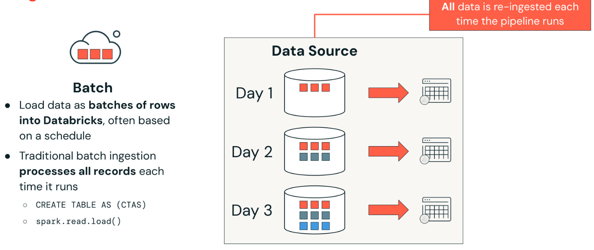
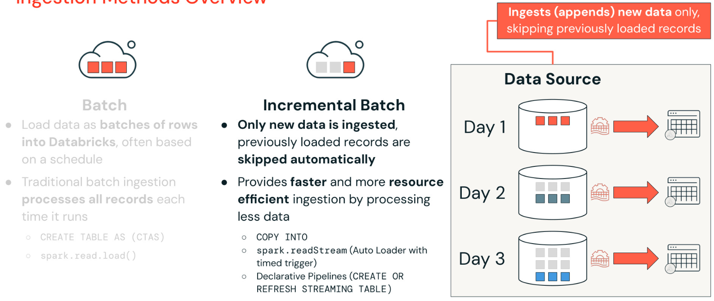
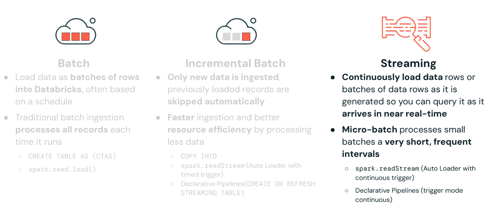
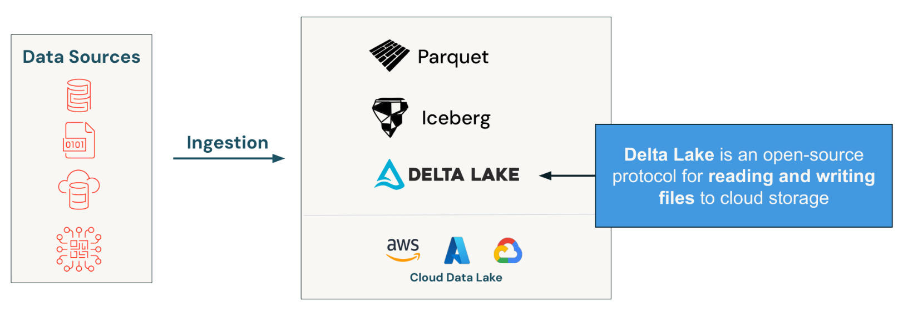
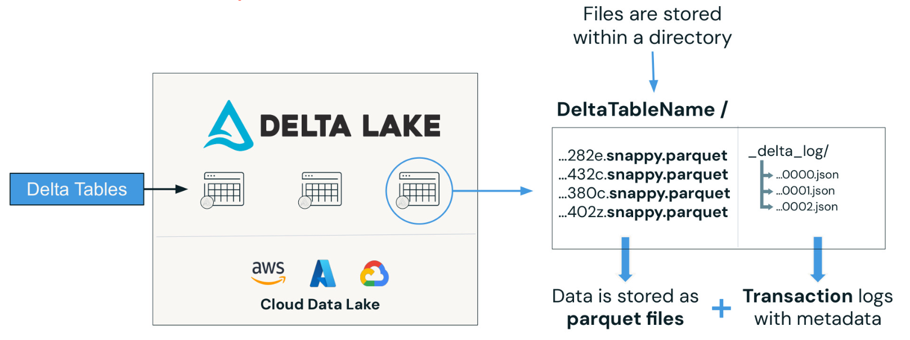
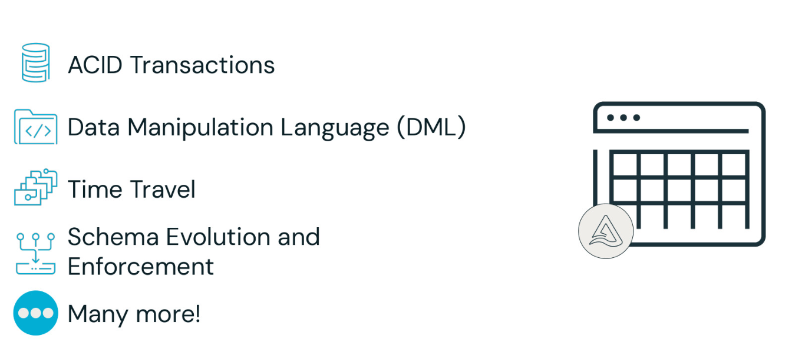

# Data Engineering in Databricks


It all begins with optimized storage using Delta Lake, Parquet, or Iceberg.

Built on top of this storage layer is unified governance with Unity Catalog. Unity Catalog is a centralized data catalog that provides access control, auditing, data lineage, quality monitoring, and data discovery across Databricks workspaces.

Databricks then offers Lakeflow, an end-to-end data engineering solution that empowers data engineers, software developers, SQL developers, analysts, and data scientists to deliver high-quality data for downstream analytics, AI, and operational applications. Lakeflow provides a unified platform for data ingestion, transformation, and orchestration, and includes the following components:
- Lakeflow Connect: A set of efficient ingestion connectors that simplify data ingestion from popular enterprise applications, databases, cloud storage, message buses, and local files.
- Lakeflow Declarative Pipelines: A framework for building batch and streaming data pipelines using SQL and Python, designed to accelerate ETL development.
- Lakeflow Jobs: A workflow automation tool for Databricks that orchestrates data processing workloads. It enables coordination of multiple tasks within complex workflows, allowing for the scheduling, optimization, and management of repeatable processes.

## What is LakeFlow Connect?


In Lakeflow connect, data ingestion is streamlined with simple, efficient connectors that enable you to bring data from files, cloud storage, databases, enterprise applications and streaming sources directly into the Databricks Lakehouse all within a unified managed platform.

Traditionally organizations are resorting to a patchwork of solutions for data ingestion when working with enterprise systems, cloud storage and streaming.

### Lakeflow connect is all ingestion


With Lakeflow Connect, you can perform efficient ingestion pipelines all within Databricks.

It's simple setup and maintenance providing Unified orchestration, observability and governance all within the Databricks Data intelligence platform. 

### Built in connectors for data intelligence platform


Lakeflow Connect provides built-in connectors for the databricks data intelligence platform to streamline data ingestion.

Key benefits include:
- A managed and efficent solution that reduces costs and accelrates time to value.
- Self-service interfaces that enable practitioners across the organization to easily ingest data from enterprise applications.
- Unified observability and governance to ensure secure, reliable and well-monitored pipelines and tables.

### Connectors Overview


Lake flow connect supports three main types of ingestion:
- **Manual File Uploads :** This allows users to upload local files directly to databricks into either a volume or as a table, making it extremely easy to bring local data into platform quickly.

- **Standard Connectors :** These connectors support data ingestion from various sources such as cloud object storage,kafka and more. They support multiple ingestion modes, including batch , incremental batch and streaming. We will explore these ingestion methods in more detail shorltly.

- **Managed Connectors :** Purpose built for ingesting data from enterpirse applications, including Saas platforms and databases. They leverage efficienrt incremental read/write patterns to provide scalable cost-effective and high performance data ingestion into the lake house.

#### Batch ingestion : 

Batch ingestion loads data as batches of rows into databricks, often based on a schedule.

Traditional batch ingestion processes all records each time it runs. Common techniques for performing batch ingestion include.
- **The sql statement :** ```CREATE TABLE AS SELECT```
- **The python method :** ```spark.read.load()```

#### Incremental batch ingestion :

While traditional batch ingestion processes all the records everytime it runs. Incremental batch ingestion automatically detects new records in the data source and skips records that have already been ingested. This means only new data is ingested.

Incremental batch ingestion is faster and more resource efficient because it processes only new records instead of reprocessing the entire data source.

Common techniques for performing incremental batch ingestion include : 
- SQL statement : ```COPY INTO```
- The python method : ```spark.readStream(Auto Loader with a time trigger)```
- Declarative Pipelines : ```CREATE OR REFRESH STREAMING TABLE```

#### Streaming Table

With streaming ingestion, data is continuously loaded as it is generated, allowing you to query it in near real-time. This method is ideal for loading streaming data from sources such as Apache Kafka, Apache Pulsar, AWS Kinesis, Google Pub/Sub.

Streaming ingestion processes data as it arrives, enabling low-latency analysis and immediate action. It contrasts micro-batch ingestion collects data over short frequent intervals (Seconds or minutes) and processing it in small batches. This strikes a balance between latency and system efficiency.

Common techniques for performing streaming ingestion include:
- spark-readStream (Auto Loader with continuous trigger)
- Declarative Pipelines (trigger mode continuous)


## DeltaLake 
DeltaLake delivers open, reliable and scalable data management for the lakehouse, empowering you to ingest data from external sources and efficiently manage it across Bronze (raw),  Silver (cleaned), Gold (curated) layers - all with full **ACID** transactions -> (**A**tomicity, **C**onsistency, **I**solation, and **D**urability) 

### Ingesting data into delta lake 


The goal is to ingest files from external data sources like cloud object storage into DeltaLake as Delta tables. Remember, Delta Lake is simply and open-source protocol for reading and writing files and to cloud storage. Delta tables often an open table format that supports the Lakehouse architecture. 

### Delta table components: 



Under the hood delta table store data within a folder directory, data is stored as parquet files and what delta adds is delta logs stored as JSON files alongside the parquet files. The delta logs keep track of all the transactions on data (parquet files) and table versions. 

The transaction logs provide a wide array of functionality to the delta table. With the transaction log, we have the concept of table states, so if you insert, delete or update data in your table, Delta basically adds a transaction (the log file) and your table stays updated and managed. So with the transaction log you are able to easily get consistent views of your data and you are actually able to travel back in time.

### Delta table key features 

Delta tables provide a variety of key features in a cloud data lake. 
- **ACID** transactions (**A**tomicity, **C**consistency, **I**solation and **D**urability) for all operations, allowing multiple users to read and write data concurrently without conflicts.
- Supports **D**ata **M**anipulation **L**anguage (DML) operations such as ```INSERT```, ```UPDATE```, and ```MERGE``` enabling flexible data management. 
- Time travel allows users to query and revert to previous versions of data facilitating auditing and recovery.
- Enforces a defined schema for data integrity while allowing schema evolution, enabling changes to the structure without breaking existing workflows. 

