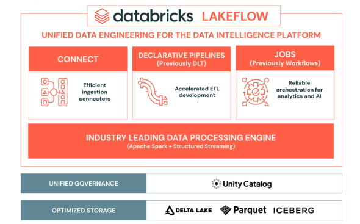
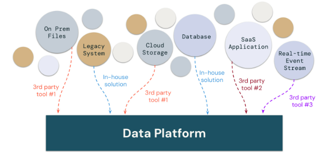
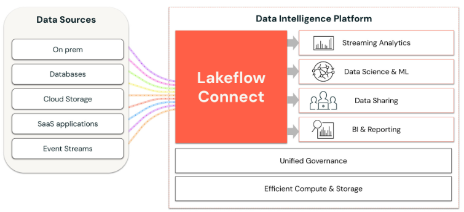
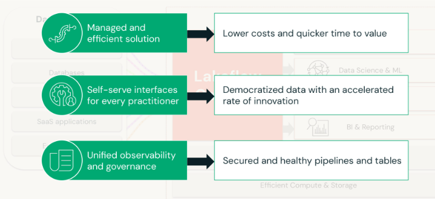
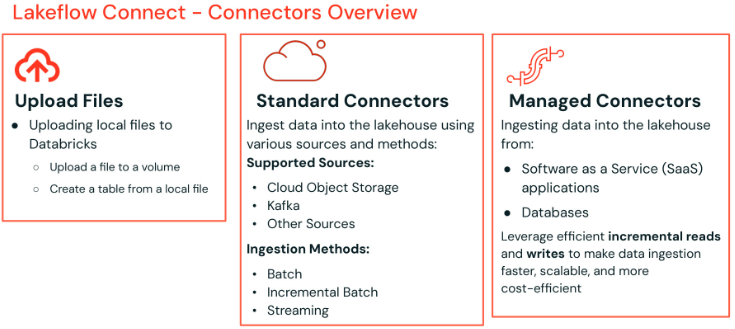

# Data Engineering in Databricks

It all begins with optimized storage using Delta Lake, Parquet, or Iceberg.

Built on top of this storage layer is unified governance with Unity Catalog. Unity Catalog is a centralized data catalog that provides access control, auditing, data lineage, quality monitoring, and data discovery across Databricks workspaces.

Databricks then offers Lakeflow, an end-to-end data engineering solution that empowers data engineers, software developers, SQL developers, analysts, and data scientists to deliver high-quality data for downstream analytics, AI, and operational applications. Lakeflow provides a unified platform for data ingestion, transformation, and orchestration, and includes the following components:
- Lakeflow Connect: A set of efficient ingestion connectors that simplify data ingestion from popular enterprise applications, databases, cloud storage, message buses, and local files.
- Lakeflow Declarative Pipelines: A framework for building batch and streaming data pipelines using SQL and Python, designed to accelerate ETL development.
- Lakeflow Jobs: A workflow automation tool for Databricks that orchestrates data processing workloads. It enables coordination of multiple tasks within complex workflows, allowing for the scheduling, optimization, and management of repeatable processes.

## What is LakeFlow Connect?

In Lakeflow connect, data ingestion is streamlined with simple, efficient connectors that enable you to bring data from files, cloud storage, databases, enterprise applications and streaming sources directly into the Databricks Lakehouse all within a unified managed platform.

Traditionally organizations are resorting to a patchwork of solutions for data ingestion when working with enterprise systems, cloud storage and streaming.

### Lakeflow connect is all ingestion

With Lakeflow Connect, you can perform efficient ingestion pipelines all within Databricks.

It's simple setup and maintenance providing Unified orchestration, observability and governance all within the Databricks Data intelligence platform. 

### Built in connectors for data intelligence platform

Lakeflow Connect provides built-in connectors for the databricks data intelligence platform to streamline data ingestion.

Key benefits include:
- A managed and efficent solution that reduces costs and accelrates time to value.
- Self-service interfaces that enable practitioners across the organization to easily ingest data from enterprise applications.
- Unified observability and governance to ensure secure, reliable and well-monitored pipelines and tables.

### Connectors Overview

It supports three main types of ingestion:
- **Manual File Uploads :** This allows users to upload local files directly to Databricks into either a volume or as a table, making it extremely easy to bring local data into the platform quickly.
- **Standard Connectors :** These connectors support data ingestion from various sources such as cloud object storage, kafka and more. They support multiple ingestion modes, including 
